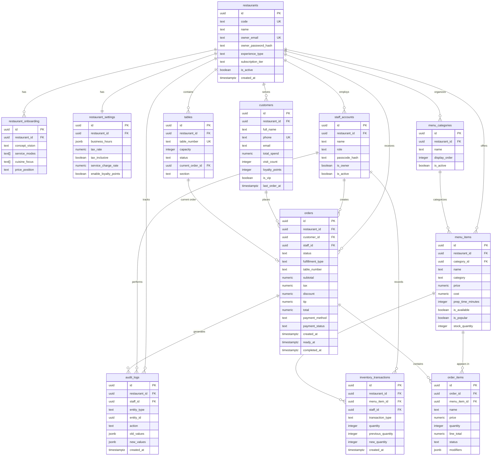
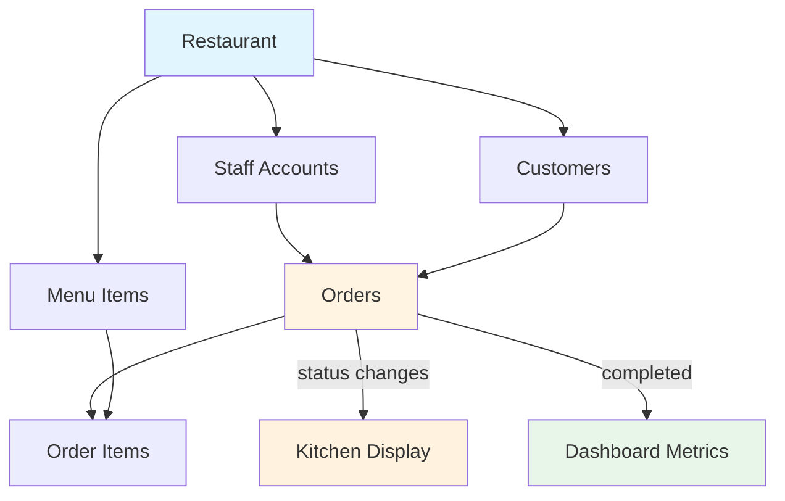
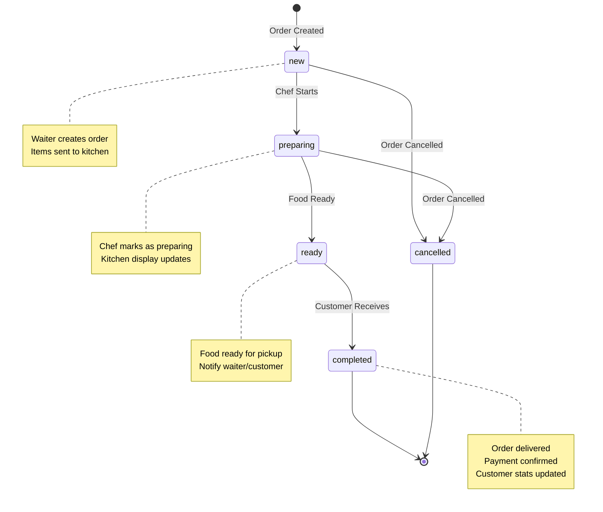
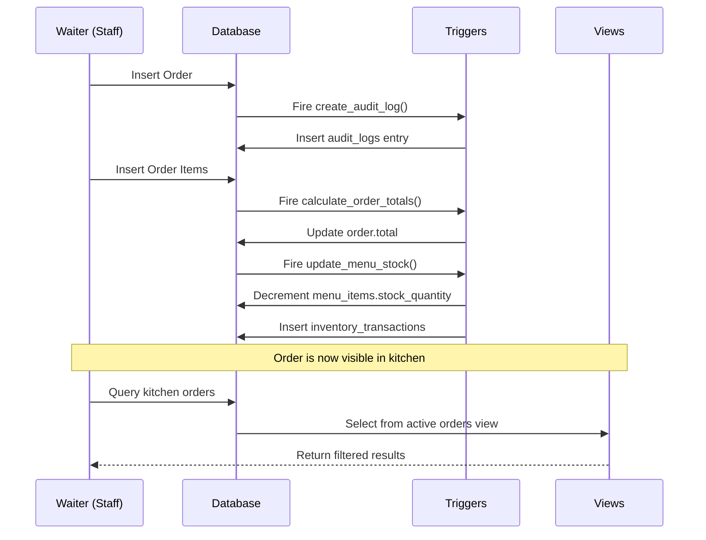
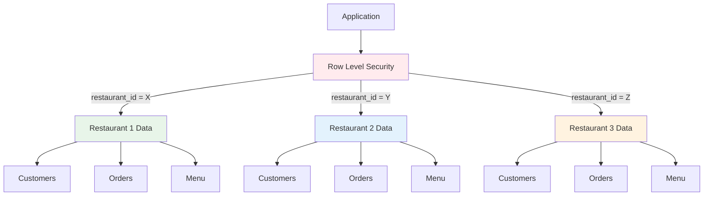
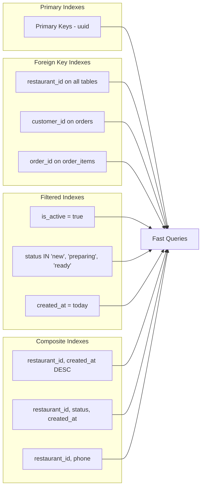
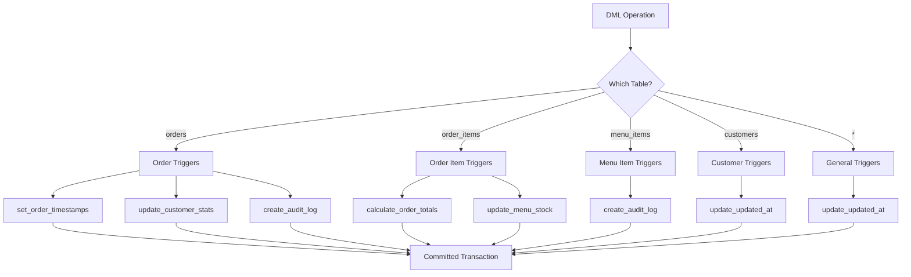
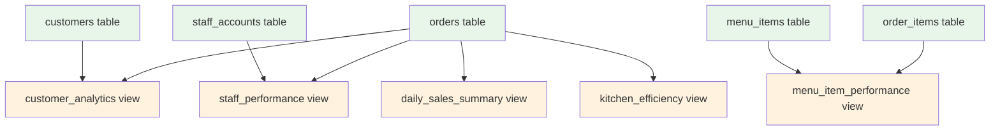
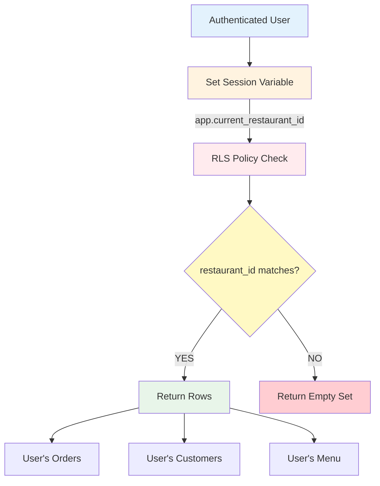
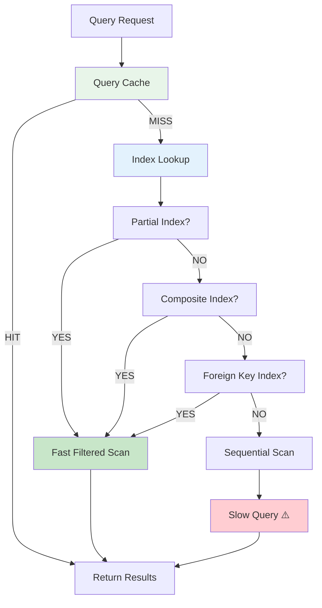

# 📐 Entity Relationship Diagram (ERD)

## Visual Database Architecture

### Full Schema Diagram (Mermaid)

---

## Simplified Core Flow Diagram

---

## Order Lifecycle State Machine

---

## Data Flow: Creating an Order

---

## Multi-Tenancy Architecture

---

## Indexing Strategy

---

## Relationship Cardinality Summary

| Relationship | Type | Cascade | Description |
|-------------|------|---------|-------------|
| Restaurant → Staff | 1:M | CASCADE | Delete restaurant → delete all staff |
| Restaurant → Customers | 1:M | CASCADE | Delete restaurant → delete all customers |
| Restaurant → Menu Items | 1:M | CASCADE | Delete restaurant → delete all menu |
| Restaurant → Orders | 1:M | CASCADE | Delete restaurant → delete all orders |
| Customer → Orders | 1:M | SET NULL | Delete customer → keep orders (orphan) |
| Staff → Orders | 1:M | SET NULL | Delete staff → keep orders (orphan) |
| Order → Order Items | 1:M | CASCADE | Delete order → delete all items |
| Menu Item → Order Items | 1:M | SET NULL | Delete menu item → keep order history |
| Category → Menu Items | 1:M | SET NULL | Delete category → keep items |
| Table → Order (current) | 1:1 | SET NULL | Delete order → free up table |

---

## Trigger Execution Flow

---

## View Dependency Tree

---

## Security Model (RLS Policies)

---

## Performance Optimization Layers

---

## Notes on Diagram Usage

### Rendering Mermaid Diagrams

These diagrams use [Mermaid](https://mermaid.js.org/) syntax. To view them:

1. **GitHub/GitLab:** Renders automatically in Markdown
2. **VS Code:** Install "Markdown Preview Mermaid Support" extension
3. **Online:** Paste into https://mermaid.live/
4. **Export:** Use mermaid-cli for PNG/SVG generation

### Legend

- **PK** = Primary Key
- **FK** = Foreign Key
- **UK** = Unique Key
- **M:M** = Many-to-Many
- **1:M** = One-to-Many
- **1:1** = One-to-One
- **→** = References / Points to

---

**Document Version:** 1.0  
**Last Updated:** December 2024  
**Tool:** Mermaid v10+  
**Status:** Complete 📐

